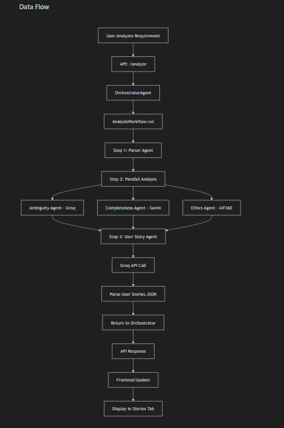
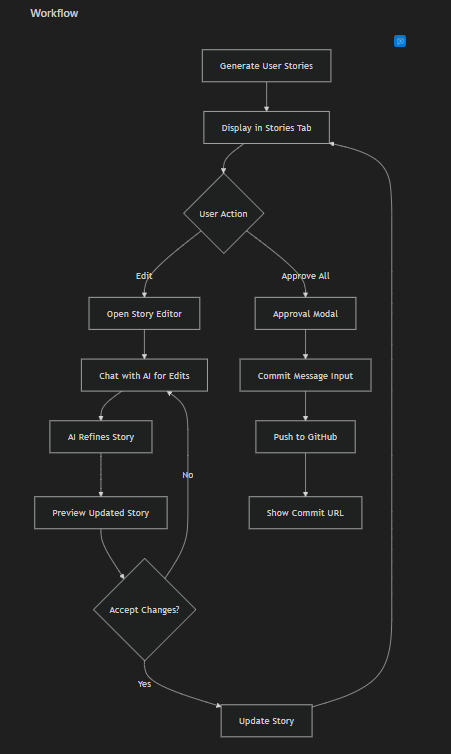

# Requirement Processing Flow

This document outlines the complete lifecycle of a requirement in the InteGrow system, from initial user input to Git commitment.

## 🔄 High-Level Overview

1.  **Input**: User submits a raw requirement.
2.  **Analysis**: Multi-agent system analyzes and enriches the requirement.
3.  **Refinement**: User interacts with AI to improve the requirement.
4.  **Approval**: User approves the final version.
5.  **Commit**: Requirement is saved as code and committed to the local Git repository.

---

## �️ Detailed Technical Flow

### 1. User Input & Initialization
- **Endpoint**: `POST /api/requirements/analyze`
- **Input**: `project_id`, `text` (raw requirement)
- **Action**:
    - Creates a record in the `requirements` database table with status `analyzing`.
    - Initializes a unique `session_id` for the refinement chat.

### 2. Multi-Agent Analysis


The `OrchestratorAgent` triggers the `AnalysisWorkflow`, which executes the following steps:

#### A. Parsing (Sequential)
- **Agent**: `ParserAgent`
- **Tool**: spaCy (Local)
- **Output**: Extracts Actors, Actions, Entities, Constraints, and Dependencies.

#### B. Issue Detection (Parallel)
Three agents run concurrently to validate the requirement:
1.  **Ambiguity Agent**:
    - **Tool**: Groq API (`llama-3.3-70b-versatile`)
    - **Action**: Identifies vague terms (e.g., "fast", "user-friendly") and suggests precise alternatives.
2.  **Completeness Agent**:
    - **Tool**: Gemini API (`gemini-2.5-flash`)
    - **Action**: Checks for missing information based on the requirement type (e.g., missing error handling, performance metrics).
3.  **Ethics Agent**:
    - **Tool**: Local Patterns / Groq
    - **Action**: Scans for bias, exclusion, or privacy risks.

#### C. User Story Generation
- **Agent**: `UserStoryAgent`
- **Tool**: Groq API
- **Action**: Converts the analyzed requirement into a set of Agile User Stories with Acceptance Criteria.

### 3. Refinement Loop (Human-in-the-Loop)


- **Endpoint**: `WebSocket /api/requirements/chat/{session_id}`
- **Service**: `WebSocketService`
- **Flow**:
    1.  Frontend displays analysis results (Quality Score, Issues, User Stories).
    2.  User asks questions or provides clarifications via chat.
    3.  AI (powered by Groq) streams responses to help refine the requirement.
    4.  User updates the requirement text based on AI suggestions.
    5.  (Optional) User re-triggers analysis on the updated text.

### 4. Approval & Commit
- **Endpoint**: `POST /api/requirements/approve`
- **Input**: `requirement_id`, `commit_message`, `branch`
- **Action**:
    1.  **Format**: Converts the final requirement and analysis data into a structured YAML format.
    2.  **Version Control**:
        - Generates a filename: `.integrow/requirements/requirements_v{X}.yaml`
        - Uses `GitAgent` to commit this file to the project's local repository.
    3.  **Database Update**:
        - Updates status to `approved`.
        - Records `approved_by`, `approved_at`, and `version`.
    4.  **Response**: Returns the Commit SHA and a link to the commit (if a remote is configured).

---

## � Artifact Structure

When a requirement is committed, it is stored in the repository with the following structure:

```yaml
# .integrow/requirements/requirements_v1.yaml
version: 1
metadata:
  created_at: "2023-10-27T10:00:00Z"
  approved_at: "2023-10-27T10:05:00Z"
  approved_by: "user-uuid"
  requirement_id: "req-uuid"
  project_id: "proj-uuid"

requirement:
  raw_text: "User should be able to login..."
  status: "approved"

analysis:
  overall_quality_score: 0.85
  parsed_entities:
    actors: ["User", "Admin"]
    actions: ["login", "reset password"]
  ambiguity:
    score: 0.9
    issues: []
  completeness:
    score: 0.8
    missing_items: [...]
  ethics:
    score: 1.0
    ethical_issues: []
```

## 🧩 Component Map

| Component | Responsibility | Key Technologies |
|-----------|----------------|------------------|
| `RequirementsRouter` | API Entry Point | FastAPI |
| `OrchestratorAgent` | Workflow Management | Python |
| `ParserAgent` | Entity Extraction | spaCy |
| `AmbiguityAgent` | Clarity Check | Groq (Llama 3) |
| `CompletenessAgent` | Gap Analysis | Gemini 2.5 |
| `GitAgent` | Version Control | GitPython |
