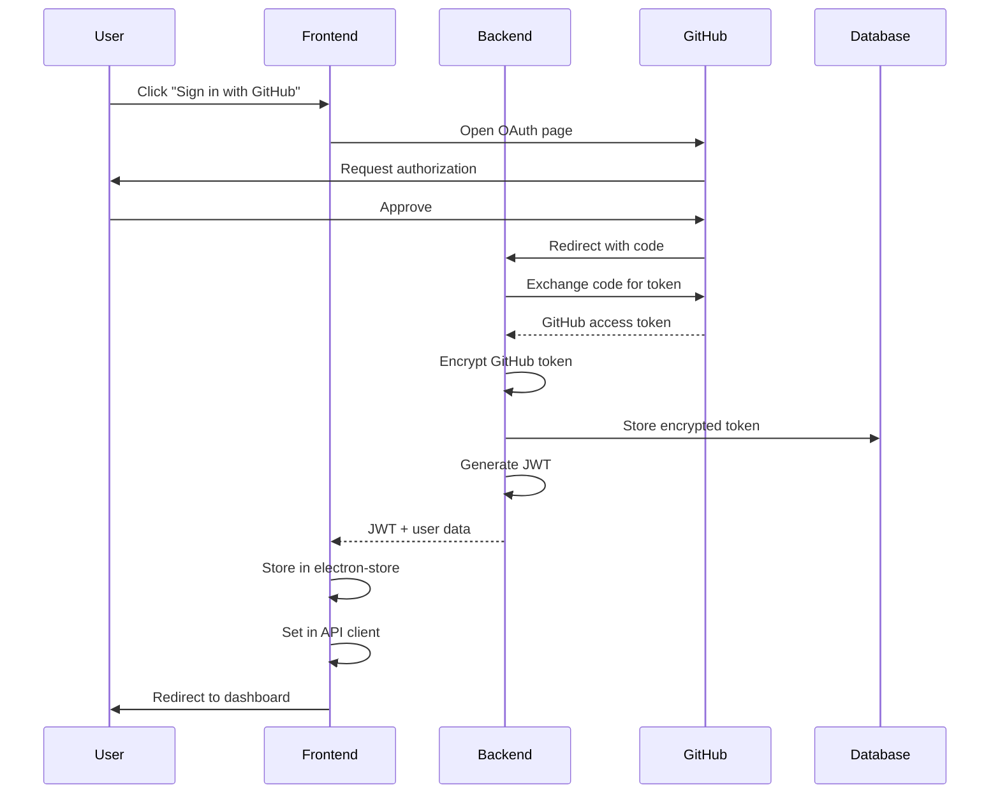
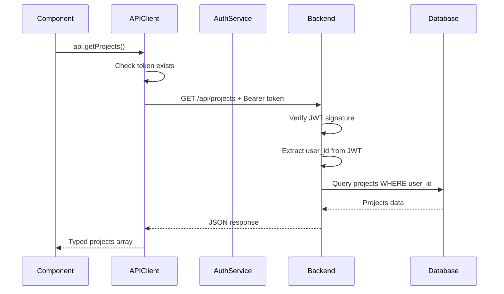
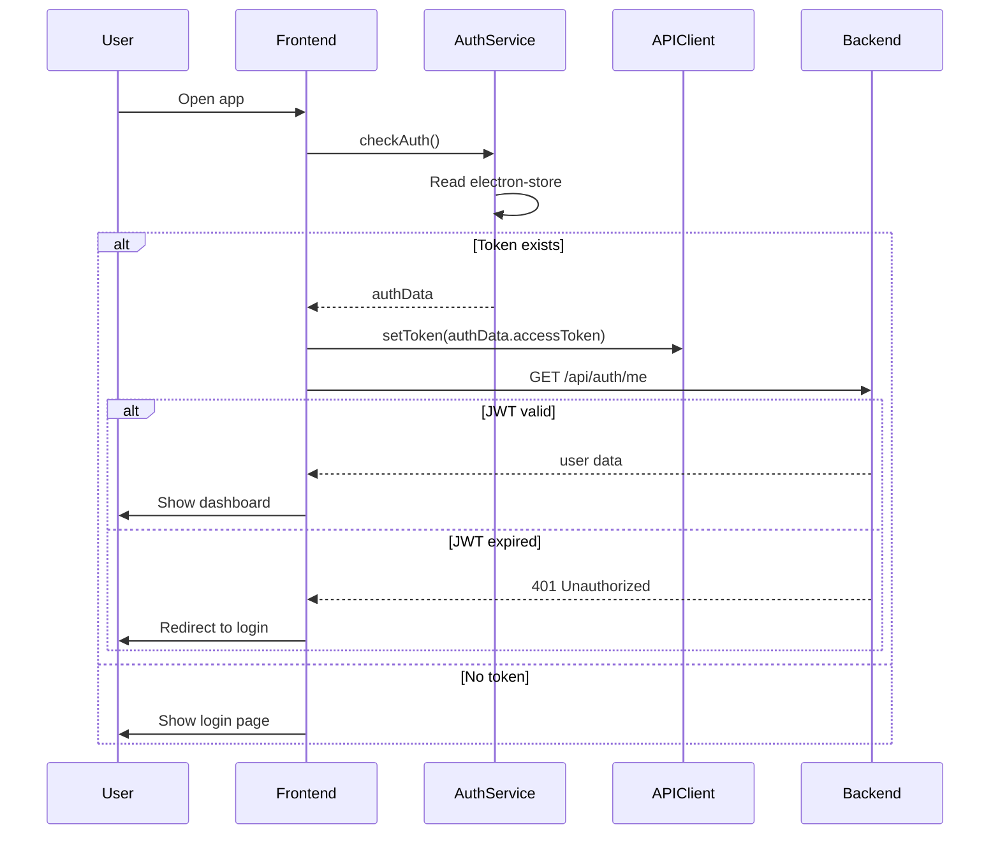
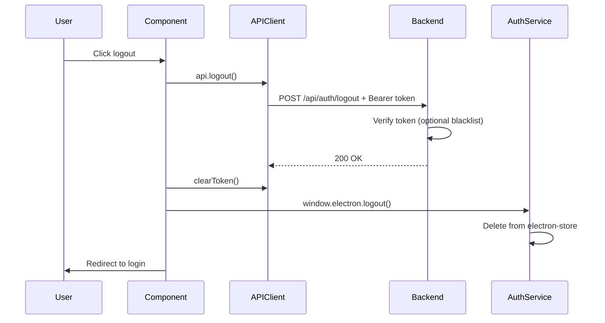

# Token Management Architecture Guide

## Overview

InteGrow uses a **multi-layered token management system** designed for security, scalability, and maintainability. This guide explains how tokens flow through the system and how to extend it for future features.

---

## 🏗️ Architecture Layers

```
┌─────────────────────────────────────────────────────────────┐
│                    Frontend (Electron)                       │
│  ┌──────────────────────────────────────────────────────┐  │
│  │  Renderer Process (React/Next.js)                     │  │
│  │  - UI Components                                      │  │
│  │  - API Client (manages in-memory token)              │  │
│  └──────────────────────────────────────────────────────┘  │
│                          ↕ IPC                              │
│  ┌──────────────────────────────────────────────────────┐  │
│  │  Main Process (Node.js)                              │  │
│  │  - AuthService (electron-store)                      │  │
│  │  - OAuth Handler                                     │  │
│  └──────────────────────────────────────────────────────┘  │
└─────────────────────────────────────────────────────────────┘
                          ↕ HTTPS
┌─────────────────────────────────────────────────────────────┐
│                    Backend (FastAPI)                         │
│  - JWT Generation & Verification                            │
│  - GitHub Token Encryption (Fernet)                         │
│  - Database Storage (Supabase)                              │
└─────────────────────────────────────────────────────────────┘
```

---

## 🔑 Token Types & Storage

### 1. JWT Access Token (Frontend)
**Purpose:** Authenticate API requests  
**Format:** `eyJhbGciOiJIUzI1NiIsInR5cCI6IkpXVCJ9...`  
**Lifetime:** 24 hours (configurable via `JWT_EXPIRATION_HOURS`)  
**Storage:** 
- **Persistent:** electron-store (main process)
- **Runtime:** APIClient instance (renderer process)

**Storage Location:**
```
Windows: %APPDATA%\integrow-auth\config.json
macOS: ~/Library/Application Support/integrow-auth/config.json
Linux: ~/.config/integrow-auth/config.json
```

**Structure:**
```json
{
  "auth_token": "eyJhbGciOiJIUzI1NiIsInR5cCI6IkpXVCJ9...",
  "user_data": {
    "id": "uuid-here",
    "github_username": "shuja609",
    "github_id": 12345,
    "email": "user@example.com",
    "avatar_url": "https://..."
  }
}
```

### 2. GitHub Access Token (Backend)
**Purpose:** Make GitHub API requests on behalf of user  
**Format:** `gho_xxxxxxxxxxxxx`  
**Lifetime:** No expiration (until revoked)  
**Storage:** Encrypted in Supabase database

**Encryption:** Fernet symmetric encryption
```python
# Backend encrypts before storage
encrypted = Fernet(key).encrypt(github_token.encode())
# Stored in database: "gAAAAABh..."
```

---

## 🔄 Token Lifecycle

### Phase 1: Authentication (Login)



**Code Flow:**

1. **Frontend initiates OAuth:**
```typescript
// renderer/app/page.tsx
await window.electron.openGitHubOAuth()
```

2. **Main process opens OAuth:**
```typescript
// main/background.ts
const authUrl = `https://github.com/login/oauth/authorize?client_id=${clientId}&scope=repo,user`
authWindow = new BrowserWindow(...)
authWindow.loadURL(authUrl)
```

3. **Backend exchanges code:**
```python
# backend/api/auth_router.py
github_token = await exchange_code_for_token(code)
encrypted_token = encrypt_token(github_token)
user = await create_or_update_user(encrypted_token)
jwt_token = create_access_token({"sub": user.id})
return {"access_token": jwt_token, "user": user}
```

4. **Frontend stores tokens:**
```typescript
// main/background.ts
AuthService.setAuth({
  accessToken: jwt_token,
  user: user_data
})
```

---

### Phase 2: API Requests (Authenticated)



**Code Flow:**

1. **Component makes request:**
```typescript
// renderer/app/dashboard/page.tsx
const response = await api.getProjects({ limit: 10 })
```

2. **API client adds token:**
```typescript
// renderer/lib/api.ts
private async request<T>(endpoint: string, options: RequestInit = {}) {
  const headers: HeadersInit = {
    'Content-Type': 'application/json',
    ...options.headers,
  }

  if (this.token) {
    headers['Authorization'] = `Bearer ${this.token}`
  }

  const response = await fetch(`${this.baseURL}${endpoint}`, {
    ...options,
    headers,
  })
  // ...
}
```

3. **Backend verifies token:**
```python
# backend/dependencies.py
async def get_current_user(credentials: HTTPAuthorizationCredentials = Depends(security)):
    payload = verify_token(credentials.credentials)
    user_id = payload.get("sub")
    user = await get_user_from_db(user_id)
    return user
```

---

### Phase 3: Session Persistence (App Restart)



**Code Flow:**

1. **Check auth on app load:**
```typescript
// renderer/app/page.tsx
useEffect(() => {
  checkAuthStatus()
}, [])

const checkAuthStatus = async () => {
  const authData = await window.electron.getAuth()
  
  if (authData) {
    api.setToken(authData.accessToken)
    router.push('/dashboard')
  }
}
```

2. **Load user data:**
```typescript
// renderer/app/dashboard/page.tsx
const loadUserData = async () => {
  const authData = await window.electron.getAuth()
  api.setToken(authData.accessToken)
  const user = await api.getCurrentUser() // Validates JWT
  setUser(user)
}
```

---

### Phase 4: Logout



**Code Flow:**

```typescript
// renderer/app/dashboard/page.tsx
const handleLogout = async () => {
  try {
    // 1. Notify backend (while token still valid)
    await api.logout()
    
    // 2. Clear runtime token
    api.clearToken()
    
    // 3. Clear persistent storage
    await window.electron.logout()
    
    // 4. Redirect
    router.push('/')
  } catch (error) {
    // Still clear locally even if backend fails
    api.clearToken()
    await window.electron.logout()
    router.push('/')
  }
}
```

---

## 🛡️ Security Features

### 1. Token Encryption
- **GitHub tokens:** Encrypted with Fernet (symmetric encryption) before database storage
- **JWT tokens:** Signed with HS256, verified on every request
- **electron-store:** OS-level encryption available (currently disabled for compatibility)

### 2. Token Validation
```python
# backend/dependencies.py
def verify_token(token: str):
    try:
        payload = jwt.decode(
            token, 
            settings.JWT_SECRET, 
            algorithms=[settings.JWT_ALGORITHM]
        )
        # Check expiration automatically
        user_id = payload.get("sub")
        if user_id is None:
            raise HTTPException(401)
        return payload
    except JWTError:
        raise HTTPException(401)
```

### 3. HTTPS in Production
- Backend requires HTTPS in production
- JWT tokens only transmitted over secure connections

### 4. Token Expiration
- JWT expires after 24 hours (default)
- Frontend automatically redirects to login on 401
- Backend validates `exp` claim automatically

---

## 🚀 Scalability Considerations

### Current Design Strengths

✅ **Separation of Concerns**
- Storage layer (AuthService) separate from usage (APIClient)
- Easy to swap electron-store for other storage solutions

✅ **Type Safety**
- Full TypeScript types for auth data
- Pydantic models on backend

✅ **IPC Abstraction**
- Renderer doesn't directly access storage
- Main process controls all storage operations

✅ **Stateless Backend**
- JWT contains all necessary info
- No server-side session storage needed
- Horizontal scaling possible

---

## 📈 Future Enhancements

### 1. Token Refresh Flow

**Current:** 24-hour JWT, must re-login after expiration  
**Future:** Add refresh tokens for seamless re-authentication

```typescript
// renderer/lib/api.ts (Future Enhancement)
private async request<T>(endpoint: string, options: RequestInit = {}) {
  let response = await fetch(url, options)
  
  if (response.status === 401) {
    // Try to refresh token
    const newToken = await this.refreshToken()
    if (newToken) {
      // Retry request with new token
      response = await fetch(url, {
        ...options,
        headers: { 
          ...options.headers, 
          'Authorization': `Bearer ${newToken}` 
        }
      })
    }
  }
  
  return response
}

async refreshToken(): Promise<string | null> {
  const refreshToken = await window.electron.getRefreshToken()
  if (!refreshToken) return null
  
  const response = await fetch(`${this.baseURL}/api/auth/refresh`, {
    method: 'POST',
    body: JSON.stringify({ refresh_token: refreshToken })
  })
  
  const { access_token } = await response.json()
  this.setToken(access_token)
  return access_token
}
```

**Backend changes needed:**
```python
# backend/api/auth_router.py
@router.post("/refresh", response_model=RefreshResponse)
async def refresh_token(request: RefreshTokenRequest):
    payload = verify_refresh_token(request.refresh_token)
    user_id = payload.get("sub")
    
    new_access_token = create_access_token({"sub": user_id})
    new_refresh_token = create_refresh_token({"sub": user_id})
    
    return {
        "access_token": new_access_token,
        "refresh_token": new_refresh_token
    }
```

---

### 2. Token Blacklisting (Logout Enhancement)

**Current:** Client-side only logout  
**Future:** Server-side token invalidation

```python
# backend/services/token_blacklist.py
from datetime import datetime, timedelta
from typing import Set

class TokenBlacklist:
    """In-memory token blacklist (use Redis in production)"""
    _blacklist: Set[str] = set()
    
    @classmethod
    async def add(cls, token: str, expires_at: datetime):
        cls._blacklist.add(token)
        # Schedule removal after expiration
        # In production: store in Redis with TTL
    
    @classmethod
    async def is_blacklisted(cls, token: str) -> bool:
        return token in cls._blacklist

# backend/dependencies.py
async def get_current_user(credentials: HTTPAuthorizationCredentials = Depends(security)):
    token = credentials.credentials
    
    # Check blacklist
    if await TokenBlacklist.is_blacklisted(token):
        raise HTTPException(401, "Token has been revoked")
    
    payload = verify_token(token)
    # ... rest of code
```

---

### 3. Multiple Sessions Management

**Future:** Allow users to see and revoke active sessions

```typescript
// New API methods
interface Session {
  id: string
  device: string
  ip: string
  last_active: string
  current: boolean
}

async getSessions(): Promise<Session[]> {
  return this.request('/api/auth/sessions')
}

async revokeSession(sessionId: string): Promise<void> {
  await this.request(`/api/auth/sessions/${sessionId}`, { method: 'DELETE' })
}
```

**Database schema:**
```sql
CREATE TABLE user_sessions (
  id UUID PRIMARY KEY DEFAULT uuid_generate_v4(),
  user_id UUID REFERENCES users(id) ON DELETE CASCADE,
  token_hash TEXT NOT NULL,
  device_info JSONB,
  ip_address TEXT,
  created_at TIMESTAMP DEFAULT NOW(),
  last_active TIMESTAMP DEFAULT NOW(),
  expires_at TIMESTAMP NOT NULL
);
```

---

### 4. Enhanced Security - OS Keychain Integration

**Current:** electron-store with optional encryption  
**Future:** Use OS-native secure storage

```typescript
// main/services/auth-service.ts (Future Enhancement)
import keytar from 'keytar'

export class AuthService {
  private static SERVICE_NAME = 'InteGrow'
  private static TOKEN_ACCOUNT = 'jwt_token'
  
  static async setAuth(authData: AuthData): Promise<void> {
    // Store token in OS keychain
    await keytar.setPassword(
      this.SERVICE_NAME, 
      this.TOKEN_ACCOUNT, 
      authData.accessToken
    )
    
    // Store user data in electron-store (non-sensitive)
    store.set('user_data', authData.user)
  }
  
  static async getToken(): Promise<string | null> {
    return await keytar.getPassword(this.SERVICE_NAME, this.TOKEN_ACCOUNT)
  }
}
```

**Benefits:**
- Windows: Credential Manager
- macOS: Keychain
- Linux: libsecret

---

### 5. OAuth Scope Management

**Current:** Fixed scopes (`repo`, `user`)  
**Future:** Dynamic scope requests based on features

```typescript
// main/background.ts (Future Enhancement)
interface OAuthOptions {
  scopes?: string[]
  state?: string
}

ipcMain.handle('github-oauth', async (event, options: OAuthOptions = {}) => {
  const scopes = options.scopes || ['repo', 'user']
  const state = options.state || generateRandomState()
  
  const authUrl = `https://github.com/login/oauth/authorize?` +
    `client_id=${clientId}&` +
    `scope=${scopes.join(',')}&` +
    `state=${state}`
  
  // ... rest of OAuth flow
})

// Usage in renderer
await window.electron.openGitHubOAuth({
  scopes: ['repo', 'user', 'gist'], // Request additional scope
  state: 'unique-state-token'
})
```

---

### 6. Multi-Account Support

**Future:** Support multiple GitHub accounts simultaneously

```typescript
// main/services/auth-service.ts (Future Enhancement)
interface AuthData {
  accounts: {
    [accountId: string]: {
      accessToken: string
      user: UserProfile
      isActive: boolean
    }
  }
  activeAccountId: string
}

export class AuthService {
  static addAccount(accountData: { accessToken: string, user: UserProfile }): void {
    const accounts = store.get('accounts', {})
    accounts[accountData.user.id] = {
      ...accountData,
      isActive: false
    }
    store.set('accounts', accounts)
  }
  
  static switchAccount(accountId: string): void {
    const accounts = store.get('accounts', {})
    
    // Deactivate all
    Object.keys(accounts).forEach(id => {
      accounts[id].isActive = false
    })
    
    // Activate selected
    accounts[accountId].isActive = true
    store.set('accounts', accounts)
    store.set('activeAccountId', accountId)
  }
  
  static getActiveAccount(): AuthData | null {
    const activeId = store.get('activeAccountId')
    const accounts = store.get('accounts', {})
    return accounts[activeId] || null
  }
}
```

---

## 🧪 Testing Token Management

### Unit Tests

```typescript
// tests/auth-service.test.ts
import { AuthService } from '../main/services/auth-service'

describe('AuthService', () => {
  beforeEach(() => {
    AuthService.clearAuth()
  })

  test('stores and retrieves auth data', () => {
    const authData = {
      accessToken: 'test-token',
      user: {
        id: '123',
        github_username: 'testuser',
        // ...
      }
    }
    
    AuthService.setAuth(authData)
    expect(AuthService.getToken()).toBe('test-token')
    expect(AuthService.isAuthenticated()).toBe(true)
  })

  test('clears auth data', () => {
    AuthService.setAuth({ /* ... */ })
    AuthService.clearAuth()
    expect(AuthService.isAuthenticated()).toBe(false)
  })
})
```

### Integration Tests

```typescript
// tests/auth-flow.test.ts
describe('Complete Auth Flow', () => {
  test('OAuth → Store → API Request → Logout', async () => {
    // 1. Simulate OAuth
    const authResponse = await fetch('http://localhost:8000/api/auth/github/callback', {
      method: 'POST',
      body: JSON.stringify({ code: 'test-code' })
    })
    const { access_token, user } = await authResponse.json()
    
    // 2. Store token
    AuthService.setAuth({ accessToken: access_token, user })
    
    // 3. Make authenticated request
    api.setToken(access_token)
    const projects = await api.getProjects()
    expect(projects.projects).toBeDefined()
    
    // 4. Logout
    await api.logout()
    AuthService.clearAuth()
    expect(AuthService.isAuthenticated()).toBe(false)
  })
})
```

---

## 📊 Monitoring & Debugging

### 1. Token Validation Logging

```python
# backend/dependencies.py
import logging

logger = logging.getLogger(__name__)

async def get_current_user(credentials: HTTPAuthorizationCredentials = Depends(security)):
    token = credentials.credentials
    
    try:
        payload = verify_token(token)
        logger.info(f"Token validated for user: {payload.get('sub')}")
        # ...
    except JWTError as e:
        logger.warning(f"Invalid token attempt: {str(e)}")
        raise HTTPException(401)
```

### 2. Frontend Token State

```typescript
// renderer/lib/api.ts
export class APIClient {
  getTokenInfo(): { hasToken: boolean; tokenPreview?: string } {
    if (!this.token) {
      return { hasToken: false }
    }
    
    return {
      hasToken: true,
      tokenPreview: `${this.token.slice(0, 10)}...${this.token.slice(-10)}`
    }
  }
}

// Usage in DevTools
console.log('Token status:', api.getTokenInfo())
```

### 3. Token Expiration Checker

```typescript
// renderer/lib/token-utils.ts
export function isTokenExpired(token: string): boolean {
  try {
    const payload = JSON.parse(atob(token.split('.')[1]))
    const exp = payload.exp * 1000 // Convert to milliseconds
    return Date.now() >= exp
  } catch {
    return true
  }
}

export function getTokenExpiration(token: string): Date | null {
  try {
    const payload = JSON.parse(atob(token.split('.')[1]))
    return new Date(payload.exp * 1000)
  } catch {
    return null
  }
}

// Usage
const authData = await window.electron.getAuth()
if (authData && isTokenExpired(authData.accessToken)) {
  console.warn('Token expired, need re-authentication')
  router.push('/')
}
```

---

## 🎯 Best Practices

### DO ✅

1. **Always validate tokens on backend**
   - Never trust client-side token validation alone

2. **Use HTTPS in production**
   - Prevent token interception

3. **Store tokens securely**
   - Use OS keychain when possible
   - Never log full tokens

4. **Handle token expiration gracefully**
   - Clear UI feedback
   - Automatic redirect to login

5. **Clear tokens on logout**
   - Both persistent and runtime storage

6. **Use short-lived tokens**
   - 24 hours max for access tokens
   - Implement refresh tokens for longer sessions

### DON'T ❌

1. **Never store tokens in:**
   - LocalStorage (web) - XSS vulnerable
   - Cookies without HttpOnly flag
   - Git repositories
   - Frontend code

2. **Never send tokens in:**
   - URL query parameters
   - GET request bodies
   - Error messages

3. **Never log sensitive data:**
   ```typescript
   // ❌ BAD
   console.log('User token:', token)
   
   // ✅ GOOD
   console.log('Token present:', !!token)
   ```

4. **Never skip token validation:**
   ```python
   # ❌ BAD
   @router.get("/projects")
   async def get_projects():
       return projects  # No auth check!
   
   # ✅ GOOD
   @router.get("/projects")
   async def get_projects(user: UserProfile = Depends(get_current_user)):
       return await get_user_projects(user.id)
   ```

---

## 🔍 Troubleshooting

### Issue: 401 Unauthorized on API requests

**Check:**
1. Token exists: `api.getTokenInfo()`
2. Token format: Should start with `eyJ`
3. Token expiration: Use `isTokenExpired(token)`
4. Backend logs: Check JWT validation errors

**Solution:**
```typescript
// Force re-authentication
await window.electron.logout()
api.clearToken()
router.push('/')
```

---

### Issue: Token persists after logout

**Check:**
1. electron-store location
2. `AuthService.clearAuth()` called
3. API client token cleared

**Solution:**
```typescript
// Manual cleanup
await window.electron.logout()
api.clearToken()
localStorage.clear() // If using localStorage
```

---

### Issue: Token not included in requests

**Check:**
1. `api.setToken()` called after login
2. Token loaded from store on app start
3. Request headers in DevTools

**Solution:**
```typescript
// On app start
const authData = await window.electron.getAuth()
if (authData) {
  api.setToken(authData.accessToken)
}
```

---

## 📚 Related Files

**Frontend:**
- `frontend/main/services/auth-service.ts` - Persistent storage
- `frontend/main/background.ts` - OAuth flow, IPC handlers
- `frontend/main/preload.ts` - IPC bridge
- `frontend/renderer/lib/api.ts` - API client with token management
- `frontend/renderer/app/page.tsx` - Login flow
- `frontend/renderer/app/dashboard/page.tsx` - Authenticated page example

**Backend:**
- `backend/dependencies.py` - JWT creation & validation
- `backend/api/auth_router.py` - Auth endpoints
- `backend/services/encryption.py` - GitHub token encryption
- `backend/config.py` - JWT settings

**Configuration:**
- `backend/.env` - JWT_SECRET, JWT_EXPIRATION_HOURS
- `frontend/package.json` - electron-store version

---

## 🎓 Summary

InteGrow's token management is built on **three pillars**:

1. **Security:** Multi-layer encryption, JWT validation, secure storage
2. **Scalability:** Stateless design, easy to extend, type-safe
3. **User Experience:** Persistent sessions, graceful expiration handling

The current implementation supports **Phase 0** requirements. Future enhancements like refresh tokens, session management, and multi-account support can be added incrementally without breaking existing functionality.

---

**Last Updated:** October 4, 2025  
**Version:** 1.0 (Phase 0)  
**Maintainer:** InteGrow Team
