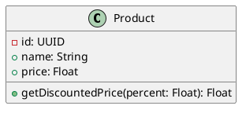

# InteGrow Code Generation System - Deep Dive

This document explains the complete code generation architecture in InteGrow, including the tech stack, pipeline flow, and how each component works together.

---

## Overview

InteGrow's code generation system transforms **UML Class Diagrams** into working **Python code** and manages the **Deployment** to your Git repository.

## Complete Visual Flow

```text
[Input Phase]
   |
   +--- UML Diagram (PlantUML)
   |       |
   |       v
   +--- UML Parser ---> [Parsed Classes]
   |
   +--- Requirements -> [Template Engine]
                           |
                           v
                    [Code Skeletons]
                           |
                           v
                    [Core Pipeline]
                           |
   +-----------------------+-----------------------+
   |  Code Enhancer AI (Groq LLaMA 3.3 70B)        |
   +-----------------------+-----------------------+
                           |
                           v
                    [Generated Files]
                           |
                           v
                    [Review Phase]
                           |
                 Preview Interface (Monaco)
                           |
                   [User Decision]
                   /             \
               (No)              (Yes: Approve)
                |                     |
          [Regenerate]                v
                                [Deployment]
                                      |
                                  GitAgent
                                      |
                            +---------+---------+
                            | Batch Commit (Local)|
                            | Push (Remote Repo)  |
                            | Update Session DB   |
                            +---------------------+
```

---

## Tech Stack

| Component | Technology | Purpose |
|-----------|------------|---------|
| **Template Engine** | Jinja2 | Renders code skeletons from templates |
| **UML Parsing** | Regex + Groq LLM | Parses PlantUML into structured data |
| **Code Enhancement** | Groq (LLaMA 3.3 70B) | Adds business logic to templates |
| **Output Language** | Python | Generates Pydantic models, FastAPI routers, Service layers |
| **Target Framework** | FastAPI + Pydantic | REST API architecture |

---

## Pipeline Architecture

### 1. Code Generation Orchestrator (`orchestrator.py`)

The main entry point that coordinates the entire pipeline.

**Flow:**
```python
1. Build Context → ContextBuilder.build()
2. Parse UML → Extract ParsedClass objects
3. Generate Files → Run generators in parallel
4. Return Result → CodeGenerationResult
```

**Key Code:**
```python
class CodeGenerationOrchestrator:
    def __init__(self):
        self.context_builder = ContextBuilder()
        self.template_engine = TemplateEngine()
        self.enhancer = CodeEnhancerAgent()
        
        self.model_gen = ModelGenerator(self.template_engine, self.enhancer)
        self.api_gen = APIGenerator(self.template_engine, self.enhancer)
        self.service_gen = ServiceGenerator(self.template_engine, self.enhancer)
```

For each class in the UML, it runs generators **in parallel**:
```python
for parsed_class in context.parsed_uml.classes:
    tasks = []
    if "models" in request.generation_scope:
        tasks.append(self.model_gen.generate(parsed_class, context))
    if "api" in request.generation_scope:
        tasks.append(self.api_gen.generate(parsed_class, context))
    if "services" in request.generation_scope:
        tasks.append(self.service_gen.generate(parsed_class, context))
    
    class_files = await asyncio.gather(*tasks)
```

---

### 2. UML Parser (`uml_parser.py`)

Converts PlantUML code into structured Python objects.

**Two-Pass Strategy:**
1. **Regex Parsing** (fast, predictable) - Primary method
2. **LLM Fallback** (Groq) - Used when regex fails

**What it extracts:**
- Class names, attributes, methods
- Visibility (+public, -private, #protected)
- Relationships (inheritance, composition, aggregation, association)
- Method parameters and return types

**Example Input:**
```plantuml
class User {
    -id: UUID
    +name: String
    -email: String
    +login(): Boolean
    +register(data: UserInput): User
}
```

**Parsed Output:**
```python
ParsedClass(
    name="User",
    attributes=[
        ParsedAttribute(name="id", type="UUID", visibility=PRIVATE),
        ParsedAttribute(name="name", type="String", visibility=PUBLIC),
        ParsedAttribute(name="email", type="String", visibility=PRIVATE),
    ],
    methods=[
        ParsedMethod(name="login", return_type="Boolean", visibility=PUBLIC),
        ParsedMethod(name="register", parameters=[...], return_type="User"),
    ]
)
```

---

### 3. Template Engine (`template_engine.py`)

Uses **Jinja2** templates to generate code skeletons.

**Type Mapping (UML → Python):**
```python
UML_TO_PYTHON_TYPES = {
    "String": "str",
    "Integer": "int", 
    "Boolean": "bool",
    "UUID": "UUID",
    "DateTime": "datetime",
    "List[String]": "List[str]",
}
```

**Available Templates:**

| Template | Output | Location |
|----------|--------|----------|
| `pydantic_model.py.jinja2` | Pydantic BaseModel | `models/classname.py` |
| `fastapi_router.py.jinja2` | FastAPI Router with CRUD | `api/classname_router.py` |
| `service.py.jinja2` | Service Layer | `services/classname_service.py` |

---

### 4. Jinja2 Templates

#### Pydantic Model Template
Generates data models with type hints:
```python
class {{ class_name }}(BaseModel):
    """{{ description or class_name + ' model.' }}"""

    {{ attr.name }}: {{ attr.type | python_type }}

```

#### FastAPI Router Template
Generates CRUD endpoints:
```python
router = APIRouter(prefix="/api/{{ class_name | lower }}s")

@router.get("/")
async def list_{{ class_name | lower }}s():
    return []

@router.post("/")
async def create_{{ class_name | lower }}(data: dict):
    return {"id": "generated-id", **data}
```

#### Service Layer Template
Generates business logic wrapper:
```python
class {{ class_name }}Service:
    async def get_all(self) -> List[dict]:
        logger.info("Fetching all {{ class_name | lower }}s")
        return []
    
    async def create(self, data: dict) -> dict:
        return {"id": "generated-id", **data}
```

---

### 5. Code Generators (`generators.py`)

Three specialized generators that combine templates + AI enhancement:

| Generator | What it creates | Template used |
|-----------|-----------------|---------------|
| `ModelGenerator` | Pydantic models | `pydantic_model.py.jinja2` |
| `APIGenerator` | FastAPI routers | `fastapi_router.py.jinja2` |
| `ServiceGenerator` | Service layer | `service.py.jinja2` |

**Each generator follows this pattern:**
```python
async def generate(self, parsed_class, context):
    # 1. Generate skeleton from template
    generated_file = self.template_engine.generate_model(parsed_class)
    
    # 2. Enhance with LLM
    enhanced_content = await self.enhancer.enhance_code(
        code=generated_file.content,
        context=context,
        file_type=FileType.MODEL,
        class_name=parsed_class.name
    )
    
    generated_file.content = enhanced_content
    return generated_file
```

---

### 6. Code Enhancer (`code_enhancer.py`)

Uses **Groq LLM (LLaMA 3.3 70B)** to add intelligence to generated code.

**What it does:**
- Adds validation logic to models
- Implements business logic in services
- Adds error handling
- Respects the context (user stories, requirements)

---

## Generation Scope

Users can choose what to generate:

| Scope | Files Generated |
|-------|-----------------|
| `models` | Pydantic BaseModel files |
| `api` | FastAPI router files |
| `services` | Service layer files |
| All | Models + API + Services |

---

## Output Structure

For a class named `User`, the system generates:

```
generated/
├── models/
│   └── user.py          # Pydantic model
├── api/
│   └── user_router.py   # FastAPI routes
└── services/
    └── user_service.py  # Business logic
```

---

## Example: Full Generation Flow

**Input UML:**


**Generated Model (`models/product.py`):**
```python
from pydantic import BaseModel
from uuid import UUID

class Product(BaseModel):
    """Product model."""
    id: UUID
    name: str
    price: float
    
    def getDiscountedPrice(self, percent: float) -> float:
        """Calculate discounted price."""
        return self.price * (1 - percent / 100)
```

**Generated Router (`api/product_router.py`):**
```python
from fastapi import APIRouter

router = APIRouter(prefix="/api/products", tags=["Product"])

@router.get("/")
async def list_products():
    return []

@router.post("/")
async def create_product(data: dict):
    return {"id": "generated-id", **data}

@router.post("/get-discounted-price")
async def get_discounted_price(percent: float):
    # Custom endpoint from UML
    pass
```

---

## 7. Approval & Commit Workflow

Once code is generated, it enters a **Review State** stored in the database. The user must explicitly approve it to deploy.

### The Approval Process
1.  **Review**: User inspects generated files in the Monaco Editor on the frontend.
2.  **Approve**: User clicks "Approve & Save" and enters a commit message (e.g., "feat: add user management").
3.  **Commit**: The backend (`/approve` endpoint) triggers the `GitAgent`.
4.  **Push**: `GitAgent` pushes changes to the configured remote branch (default: `main`).

### Technical Implementation

**Backend Endpoint (`/approve`):**
- **Input**: `session_id`, `commit_message`
- **Action**:
    - Fetches the session and associated files.
    - Writes files to the local repository path.
    - Executes `git add .` and `git commit`.
    - Executes `git push`.
    - Updates `code_generation_sessions` with `commit_sha` and `approved_at`.

**Git Agent Capabilities:**
- Handles **batch commits** (multiple files in one atomic commit).
- Manages upstream tracking branches automatically.
- Provides rollback safety (if push fails, local changes can be reset).

---

## Key Files Reference

| File | Purpose |
|------|---------|
| `backend/agents/code_generation/orchestrator.py` | Main pipeline coordinator |
| `backend/agents/code_generation/template_engine.py` | Jinja2 template rendering |
| `backend/agents/code_generation/uml_parser.py` | PlantUML parsing |
| `backend/agents/code_generation/generators.py` | Concrete generators |
| `backend/templates/python/pydantic_model.py.jinja2` | Model template |
| `backend/templates/python/fastapi_router.py.jinja2` | Router template |
| `backend/templates/python/service.py.jinja2` | Service template |

---

## Summary

InteGrow's code generation is a **hybrid system** combining:
- **Deterministic templates** (Jinja2) for consistent structure
- **AI enhancement** (Groq LLM) for intelligent business logic
- **Parallel execution** for speed
- **UML-to-code mapping** for design-driven development

This approach gives you the best of both worlds: predictable, well-structured code with AI-enhanced logic.
